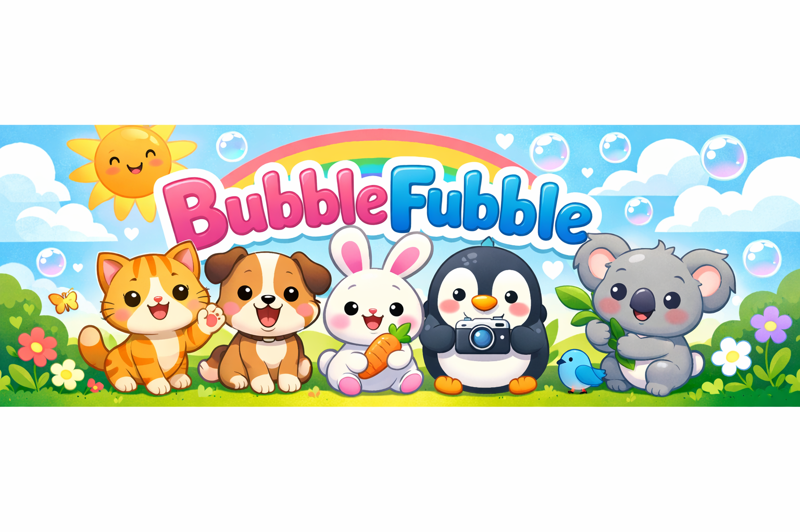

<p align="center">
  
</p>

<p align="center">
  <a href="https://github.com/sackgirl80/BubbleFubble/actions"></a>
  
  
  
</p>

<p align="center">
  A Telegram bot that sends a cute animal photo every morning and chats back using AI.<br>
  Built with pure Node.js — no frameworks, just fun.
</p>

---

## What does it do?

Every morning, BubbleFubble picks a random cute animal photo from the internet and sends it to your Telegram chat with a cheerful German caption. If you reply, it chats back using AI — in whatever language you write in!

It also comes packed with **15 fun features** like animal trivia, trading cards, guessing games, and an ongoing adventure story starring the animals you name.

## Quick Start

```bash
git clone git@github.com:sackgirl80/BubbleFubble.git
cd BubbleFubble
npm install
cp .env.example .env    # then fill in your keys (see Setup below)
node index.js            # send a test photo
node bot.js              # start chatting
```

## Setup

<details>
<summary><b>1. Create a Telegram bot</b></summary>

1. Open Telegram and search for `@BotFather`
2. Send `/newbot` and follow the prompts
3. Copy the **bot token** you receive

</details>

<details>
<summary><b>2. Get API keys</b></summary>

**Pexels** (animal photos) — free, no credit card:
- Sign up at https://www.pexels.com/api/ and copy your API key

**AI provider** (chat replies) — choose one:

| Provider | Quality | Cost | Signup |
|:---------|:--------|:-----|:-------|
| **Anthropic** (Claude Haiku) | Excellent | ~$0.001/msg | [console.anthropic.com](https://console.anthropic.com/) |
| **Grok** (xAI) | Very good | $25 free credit | [console.x.ai](https://console.x.ai/) |
| **Groq** (Llama 3.3 70B) | Good | Free (100K tokens/day) | [console.groq.com](https://console.groq.com/keys) |

</details>

<details>
<summary><b>3. Configure your .env file</b></summary>

```bash
cp .env.example .env
```

Fill in your values:

```env
TELEGRAM_BOT_TOKEN=your_bot_token_here
TELEGRAM_CHAT_ID=your_chat_id_here          # set in step 4
PEXELS_API_KEY=your_pexels_api_key_here

# Choose one AI provider:
AI_PROVIDER=grok                             # or "anthropic" or "groq"
GROK_API_KEY=your_key_here
# ANTHROPIC_API_KEY=your_key_here
# GROQ_API_KEY=your_key_here
```

</details>

<details>
<summary><b>4. Get the chat ID</b></summary>

The recipient opens your bot in Telegram and sends `/start`. Then run:

```bash
node get-chat-id.js
```

Copy the chat ID into `.env` as `TELEGRAM_CHAT_ID`.

</details>

<details>
<summary><b>5. Test it!</b></summary>

```bash
node index.js    # sends a cute animal photo
node bot.js      # starts the chat bot (Ctrl+C to stop)
```

</details>

## Features

BubbleFubble has **15 features** you can enable or disable right in the chat! Just ask: *"What features do you have?"* or *"Disable stickers"*.

### Daily Photo Experience

| | Feature | What it does |
|:--|:--------|:-------------|
| 🔎 | **Guess the Animal** | A poll before each photo — can you guess the animal from 5 choices? |
| 🃏 | **Trading Cards** | Collectible stat cards for each animal (cuteness, fluffiness, speed...) |
| 💡 | **Animal Facts** | A fun, surprising animal fact after each photo |
| 🌍 | **Multilingual Vocab** | Learn what the animal is called in 5 different languages |
| 🐾 | **Name the Animal** | Give each animal a name — the bot remembers them all! |
| 🧠 | **Daily Quiz** | Animal trivia questions to test your knowledge |

### Stories & Streaks

| | Feature | What it does |
|:--|:--------|:-------------|
| 📖 | **Story Mode** | An ongoing adventure story starring all the animals you've named |
| 🔥 | **Chat Streak** | Tracks how many days in a row you've chatted — don't break the streak! |
| 📋 | **Weekly Recap** | Every Sunday: a summary of the week's animals, names, and highlights |
| 🏆 | **Photo of the Week** | Vote on your favourite photo every Sunday |
| 🎂 | **Birthday Countdown** | Counts down to your birthday with a special message on the day |

### Chat & Mood

| | Feature | What it does |
|:--|:--------|:-------------|
| 😊 | **Mood Check-in** | Occasionally asks how you're doing and cheers you up |
| 🌅 | **Time-based Mood** | The bot adjusts its tone based on the time of day |
| ✨ | **Emoji Reactions** | Extra cute emoji reactions sprinkled into messages |
| 💰 | **Credit Balance** | Ask the bot how much API credit you have left |

### Credit balance

<details>
<summary>Setup for credit balance checking (optional)</summary>

The bot can check your xAI/Grok prepaid balance live. To enable:

1. Go to [console.x.ai](https://console.x.ai/) → Settings → Management Keys
2. Create a new management key
3. Add to `.env`:
   ```
   XAI_MANAGEMENT_KEY=your_management_key_here
   ```
   The team ID is auto-detected from your `GROK_API_KEY`.

</details>

## Schedule daily runs (macOS)

```bash
bash setup.sh
```

This installs two background services:
- **Daily photo** at 6:30 AM (catches up if your Mac was asleep)
- **Chat bot** runs continuously, auto-restarts if it crashes

<details>
<summary>Managing the schedule</summary>

**Change photo time:** Edit the `Hour` and `Minute` values in `setup.sh` before running it.

**Send an extra photo:** `node index.js`

**Restart the bot:** `launchctl kickstart -k gui/$(id -u)/com.bubblefubble.bot`

**Check logs:**
```bash
cat logs/bubblefubble.log        # daily photo
cat logs/bot.log                  # chat bot
```

**Uninstall:**
```bash
launchctl bootout gui/$(id -u) ~/Library/LaunchAgents/com.bubblefubble.daily-animal-photo.plist
launchctl bootout gui/$(id -u) ~/Library/LaunchAgents/com.bubblefubble.bot.plist
rm ~/Library/LaunchAgents/com.bubblefubble.*.plist
```

</details>

## How it works

| | |
|:--|:--|
| **Photo sources** | Pexels (50%), The Cat API (25%), random.dog (25%) with automatic fallback |
| **No duplicates** | Every photo ID is tracked in `sent-photos.json` — you'll never see the same one twice |
| **AI chat** | Telegram long polling + your choice of AI provider with conversation history |
| **Features** | Pluggable system loaded from `features/` — toggle on/off via chat |
| **Language** | The bot matches whatever language you write in |

## Adding new features

Create a file in `features/` — the bot loads it automatically on next restart:

```js
module.exports = {
  id: 'my_feature',
  name: 'My Feature',
  description: 'What it does',
  defaultEnabled: true,
  promptAddition: 'Instructions for the AI when this feature is enabled.',
  tools: [],                          // Optional: extra AI tools
  async afterPhoto(ctx) {},           // Optional: runs after a photo is sent
  async onDaily(ctx) {},              // Optional: runs during daily photo
  async handleTool(name, args, ctx) {} // Optional: handle custom tool calls
};
```

---

<p align="center">
  Made with love for daily smiles 🐾
</p>
